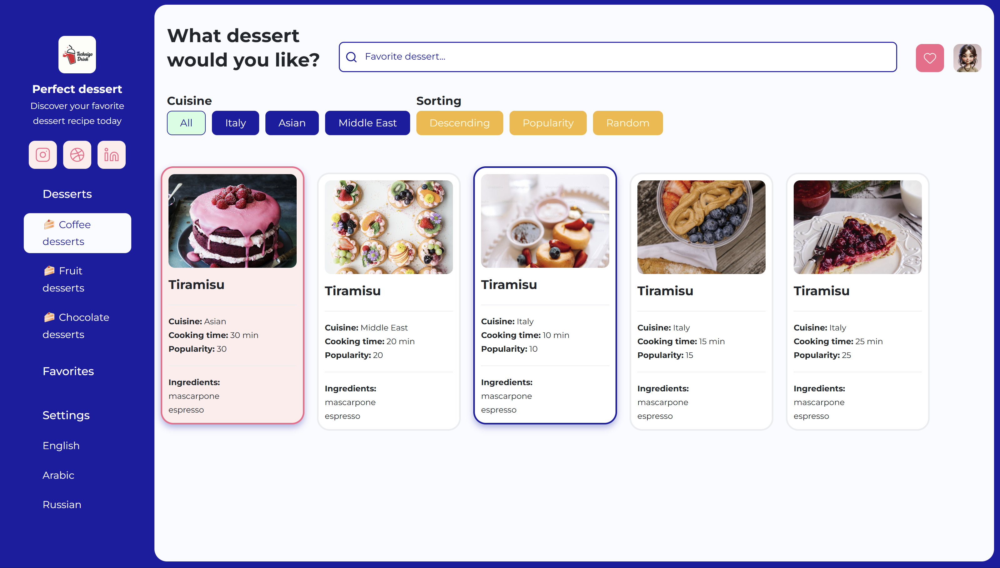

# 🍰 Favorite Dessert

**Favorite Dessert** is a fun and interactive dessert recipe app built during Technigo’s Advanced JavaScript & TypeScript course. You can explore, filter, sort, and save your favorite desserts while practicing real API integration, dynamic DOM rendering, and responsive design.

The project is live on [Netlify](https://favorate-dessert.netlify.app/).

---

## 🔗 Demo

Check it out here: [Favorite Dessert on Netlify](https://favorate-dessert.netlify.app/)

---

## 📸 Screenshot



---

## 🚀 Features

- 🔍 **Search desserts** by name
- 🍽️ **Cuisine filter**: British, Chinese, Indian, or All
- 🔄 **Sorting options**:
  - Descending ⬇️ / Ascending ⬆️
  - Less popular ⭐ / More popular ⭐⭐⭐
  - Random 🎲
- ❤️ **Like your favorite desserts** and view them in the **Favorites** section
- 📱 Fully **responsive design** — works on desktop, tablet, and mobile

---

## 🧰 Tech Stack / What I Built With

- **HTML / CSS / SASS** for structure, layout, and styling
- **CSS Grid** for responsive card layout
- **CSS animations** for loading spinner and transitions
- **Vanilla JavaScript**:
  - `map()`, `filter()`, `sort()` for array logic
  - `async/await` for API calls
  - `fetch()` API for real recipe data
  - `localStorage` for caching API responses
  - DOM manipulation using `innerHTML` and `classList`
  - Event handling with `addEventListener()`
- **Lucide Icons** for interactive UI elements

---

## 🧠 How It Works

1. On page load, the app fetches 15 random dessert recipes from the Spoonacular API.
2. API responses are cached in **localStorage** to minimize requests and respect quota limits.
3. If the API fails or the daily quota is exceeded, the app falls back to **local demo data**.
4. Desserts are dynamically rendered with **images, cooking time, ingredients, and popularity**.
5. Users can **filter by cuisine** or **sort recipes** by popularity, cooking time, or randomly.
6. **Favorites system**: click the heart icon to like/unlike desserts; favorites persist in localStorage.
7. The layout is fully **responsive**, adapting from mobile to large desktop screens.

---

## 📂 File Structure

```
📂 css/ # Stylesheets
📂 img/ # Dessert images
📂 js/ # JavaScript logic
📂 sass/ # SASS files
│
├── 📁 abstracts/ # Variables, mixins, functions
├── 📁 base/ # Base styles (reset, typography)
├── 📁 cards/ # Card styles for desserts
├── 📁 components/ # Reusable UI components
├── 📁 layout/ # Layout and grid styles
└── 📁 page/ # Page-specific styles
```

---

## 📄 Project Requirements

- Display recipes dynamically from API or demo data ✅
- Filter by at least one property (cuisine) ✅
- Sort by at least one property (popularity or cooking time) ✅
- Random recipe button ✅
- Empty state when no results match the filter
- Fully responsive layout (320px → 1600px+) ✅

---

## 📝 What I Learned

- How to fetch and handle data from a real API with async/await
- Implementing fallback strategies when API fails or quota is exceeded
- Caching API responses in localStorage
- Creating dynamic, data-driven UI with `.map().join("")`
- Filtering, sorting, and updating the DOM efficiently
- Implementing a favorites system that persists across page refreshes
- Responsive design using CSS Grid and media queries
- Building a friendly UX with loading states and empty states

---

## 🔜 Next Steps

- Add detailed recipe view / modal
- Implement dietary restriction filters
- Enable recipe sharing or rating system
- Improve accessibility further

---

## 📄 License

This project is free to use for educational purposes.
